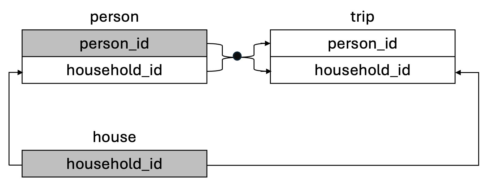

<!-- README.md is generated from README.Rmd. Please edit that file -->

```{r, include = FALSE}
knitr::opts_chunk$set(
  collapse = TRUE,
  comment = "#>",
  fig.path = "man/figures/README-",
  out.width = "100%"
)
```

# tripaccess

<!-- badges: start -->
<!-- badges: end -->

This data package contains four subsets `tripaccess`, `person`, `house`, and `trip`, constructed from the [National Household Travel Survey (NHTS)](https://nhts.ornl.gov/) 2017 person, house, and trip files. It includes personal trips, mobility, demographic, and household information. 

One goal of this data package is to increase awareness of disability inclusion by examining factors or characteristics that are associated with different travel behaviors of people who have a travel disability. The `tripaccess` and `person` datasets include a variable travel_disability, indicating whether respondents have a medical condition "that makes it difficult to travel outside of home". These two datasets also include travel accommodations information, e.g., walker, cane. Note that the NHTS 2017 has imbalanced classes of people who have a travel disability and people who do not have a travel disability. So this data package can be used for data ethics discussion, e.g., ethical concerns of underrepresentation of marginalized groups in your data.

Overall, this data package is suitable for data visualization, data wrangling, joining datasets, exploratory data analysis (EDA), group comparisons, simple linear regression, categorical data analysis, and data ethics discussion in data science and statistics classes.

## Disability Inclusion Background

The transport system is a pillar for ensuring social equity (Pagliara & Di Ciommo, 2020). People often need to travel to work, study, connect with other people, shop groceries, attend medical appointments, and participate in fun events. There have been uneven distributions of travel resources in the current built environment for disabled people, which causes barriers to access for them (Levine & Karner, 2023). This data package can be used to study economic and social participation from a critical disability lens and provide policy implications for building a more equitable and inclusive transport system. 

## Installation

Install the development version of tripaccess from GitHub:

``` r
# If you haven't installed the remotes package yet, do so:
# install.packages("remotes")
remotes::install_github("scao53/tripaccess")
```

``` r
# Load package
library(tripaccess)
```

## Datasets Included

-   `tripaccess`: tripaccess, constructed from the NHTS 2017 person and trip files, includes disability and other demographic as well as mobility and trip categorical and numeric variables. It has 86,521 rows (each row is a person) and 40 columns. It can be used for data visualization, single table data wrangling, EDA, group comparisons, and categorical data analysis.
-   `person`: person, constructed from the NHTS 2017 person file, includes disability, mobility, and other demographic categorical and numeric variables. It has 99,564 rows (each row is a person) and 32 columns. It can be used for data visualization, single table analysis, EDA, group comparisons, and categorical data analysis. It can also be used together with the `house` and `trip` datasets for joining datasets (see Data Relationships).
-   `house`: house, constructed from the NHTS 2017 house file, includes household characteristics categorical and numeric variables. It has 129,695 rows (each row is a household) and 9 columns. It can be used for beginners' exercises, such as data visualization, data wrangling, and EDA. It can also be used together with the `person` and `trip` datasets for joining datasets (see Data Relationships).
-   `trip`: trip, constructed from the NHTS 2017 trip file, includes trip related categorical and numeric variables. It has 921,590 rows (each row is a trip) and 8 columns. It can be used for beginners' exercises, such as data visualization, data wrangling, EDA, and simple linear regression. It can also be used together with the `person` and `house` datasets for joining datasets (see Data Relationships).

## Data Relationships

The `person`, `house`, and `trip` datasets can be used together for joining data. The top of each table shows the dataset name. The grey-shaded variables are primary keys while the others are foreign keys. The arrows show how the datasets are connected. 



-   Use person_id and household_id to join the `person` dataset and the `trip` dataset.
-   Use household_id to join the `house` dataset and the `person` dataset.
-   Use household_id to join the `house` dataset and the `trip` dataset.
