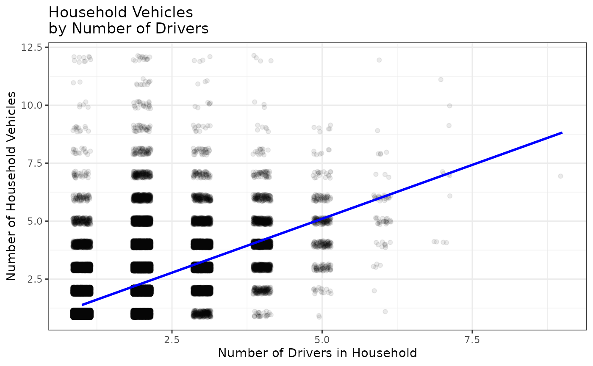

# house

## Setup

``` r

devtools::install()
```

``` r

library(tripaccess)
library(tidyverse)
```

## Exploratory Data Analysis Example

This example uses the `house` dataset to explore whether households with
more drivers tend to have more vehicles.

``` r

#> Filtered to households with at least one driver
house_with_drivers <- house |>
  filter(number_drivers > 0)

#> Summary statistics of vehicles by number of drivers
house_with_drivers |>
  group_by(number_drivers) |>
  summarize(
    households = n(),
    mean_vehicles = mean(number_vehicles),
    median_vehicles = median(number_vehicles),
    sd_vehicles = sd(number_vehicles)
  )
#> # A tibble: 8 × 5
#>   number_drivers households mean_vehicles median_vehicles sd_vehicles
#>            <dbl>      <int>         <dbl>           <dbl>       <dbl>
#> 1              1      47652          1.30               1       0.772
#> 2              2      65404          2.34               2       0.966
#> 3              3       9156          3.21               3       1.11 
#> 4              4       2274          3.99               4       1.25 
#> 5              5        384          4.62               5       1.42 
#> 6              6         69          5.39               5       1.60 
#> 7              7         12          6.67               7       2.42 
#> 8              9          1          7                  7      NA

#> Filtered to households with at least one vehicle
house_with_vehicles <- house_with_drivers |>
  filter(number_vehicles > 0)

#> Plot household vehicles by number of drivers
ggplot(data = house_with_vehicles,
       aes(x = number_drivers,
           y = number_vehicles)) +
  geom_jitter(alpha = 0.08, width = 0.15, height = 0.15) +
  geom_smooth(method = lm, se = FALSE, formula = y ~ x, color = "blue") +
  labs(title = "Household Vehicles \nby Number of Drivers",
       x = "Number of Drivers in Household",
       y = "Number of Household Vehicles") +
  theme_bw()
```



``` r


#> Fit a simple linear regression model
vehicles_drivers_model <- lm(number_vehicles ~ number_drivers,
                             data = house_with_vehicles)
summary(vehicles_drivers_model)
#> 
#> Call:
#> lm(formula = number_vehicles ~ number_drivers, data = house_with_vehicles)
#> 
#> Residuals:
#>     Min      1Q  Median      3Q     Max 
#> -5.0296 -0.3816 -0.3112  0.6184 10.6184 
#> 
#> Coefficients:
#>                Estimate Std. Error t value Pr(>|t|)    
#> (Intercept)    0.452039   0.006892   65.59   <2e-16 ***
#> number_drivers 0.929588   0.003653  254.44   <2e-16 ***
#> ---
#> Signif. codes:  0 '***' 0.001 '**' 0.01 '*' 0.05 '.' 0.1 ' ' 1
#> 
#> Residual standard error: 0.905 on 122996 degrees of freedom
#> Multiple R-squared:  0.3448, Adjusted R-squared:  0.3448 
#> F-statistic: 6.474e+04 on 1 and 122996 DF,  p-value: < 2.2e-16

#> Correlation between number of drivers and number of vehicles
cor(house_with_vehicles$number_drivers, house_with_vehicles$number_vehicles)
#> [1] 0.5872373

#> The slope estimates the average change in household vehicles for one
#> additional driver in the household.
coef(vehicles_drivers_model)["number_drivers"]
#> number_drivers 
#>      0.9295881
```
