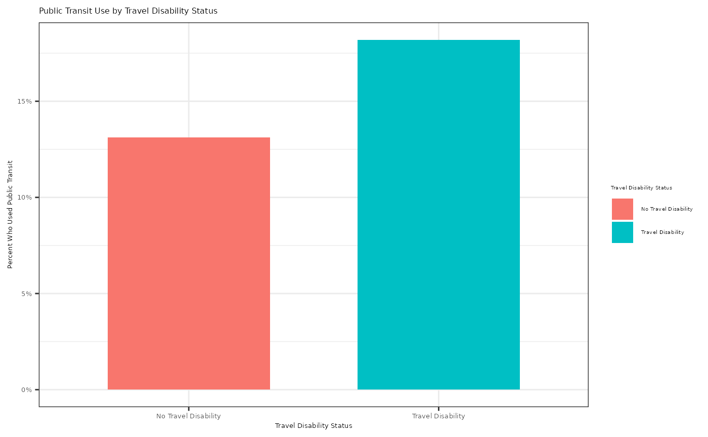

# person

## Setup

``` r

devtools::install()
```

``` r

library(tripaccess)
library(tidyverse)
```

## Exploratory Data Analysis Example

This example uses the `person` dataset to explore public transit use by
travel disability status. The main question is whether individuals who
have a travel disability report using public transit in the last month
at different rates than individuals who do not have a travel disability.

``` r

#> Create readable labels for travel disability status and public transit use
person_transit <- person |>
  mutate(
    travel_disability_group = case_when(
      travel_disability == "No_disability" ~ "No Travel Disability",
      TRUE ~ "Travel Disability"
    ),
    public_transit_status = case_when(
      count_of_public_transit_usage > 0 ~ "Used Public Transit",
      TRUE ~ "Did Not Use Public Transit"
    )
  )

#> Sort labels
person_transit$travel_disability_sort_val <- factor(person_transit$travel_disability_group, levels = c("No Travel Disability", "Travel Disability"))
person_transit$public_transit_sort_val <- factor(person_transit$public_transit_status, levels = c("Did Not Use Public Transit", "Used Public Transit"))

#> Summary statistics of public transit use by travel disability status
transit_summary <- person_transit |>
  group_by(travel_disability_sort_val) |>
  summarize(
    people = n(),
    public_transit_users = sum(count_of_public_transit_usage > 0),
    public_transit_use_prop = mean(count_of_public_transit_usage > 0),
    public_transit_usage_median = median(count_of_public_transit_usage),
    public_transit_usage_mean = mean(count_of_public_transit_usage),
    public_transit_usage_sd = sd(count_of_public_transit_usage)
  )

transit_summary
#> # A tibble: 2 × 7
#>   travel_disability_sort_val people public_transit_users public_transit_use_prop
#>   <fct>                       <int>                <int>                   <dbl>
#> 1 No Travel Disability        92897                12190                   0.131
#> 2 Travel Disability            6667                 1213                   0.182
#> # ℹ 3 more variables: public_transit_usage_median <dbl>,
#> #   public_transit_usage_mean <dbl>, public_transit_usage_sd <dbl>

#> Plot Public Transit Use by Travel Disability Status
person_transit |>
  count(travel_disability_sort_val, public_transit_sort_val) |>
  group_by(travel_disability_sort_val) |>
  mutate(public_transit_use_prop = n / sum(n)) |>
  filter(public_transit_sort_val == "Used Public Transit") |>
  ggplot(aes(x = travel_disability_sort_val,
             y = public_transit_use_prop,
             fill = travel_disability_sort_val)) +
  geom_col(width = 0.65) +
  scale_y_continuous(labels = function(x) paste0(round(100 * x), "%")) +
  labs(title = "Public Transit Use by Travel Disability Status",
       x = "Travel Disability Status",
       y = "Percent Who Used Public Transit",
       fill = "Travel Disability Status") +
  theme_bw() +
  theme(axis.text = element_text(size = 5),
        axis.title = element_text(size = 5),
        title = element_text(size = 5),
        legend.text = element_text(size = 4),
        legend.title = element_text(size = 4))
```



``` r


#> Test whether public transit use differs by travel disability status
prop.test(
  x = transit_summary$public_transit_users,
  n = transit_summary$people
)
#> 
#>  2-sample test for equality of proportions with continuity correction
#> 
#> data:  transit_summary$public_transit_users out of transit_summary$people
#> X-squared = 136.93, df = 1, p-value < 2.2e-16
#> alternative hypothesis: two.sided
#> 95 percent confidence interval:
#>  -0.06031243 -0.04112818
#> sample estimates:
#>    prop 1    prop 2 
#> 0.1312206 0.1819409
```
