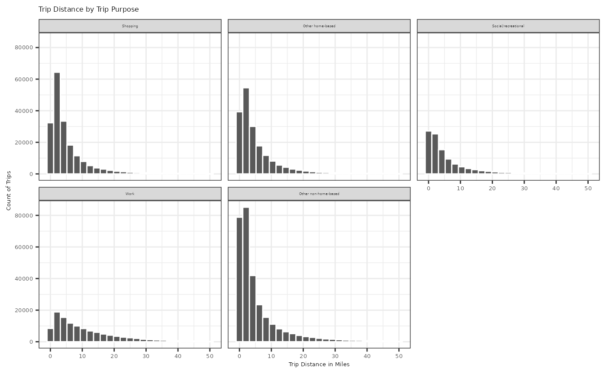
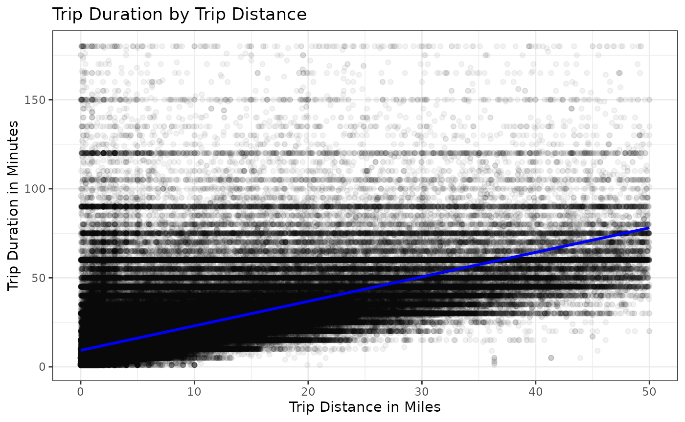
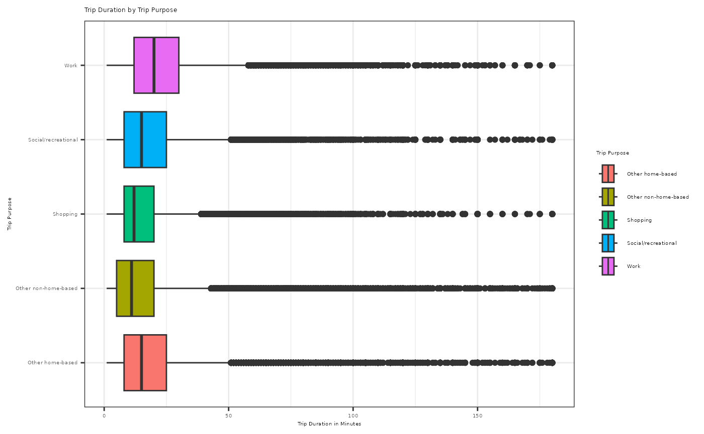

# trip

## Setup

``` r

devtools::install()
```

``` r

library(tripaccess)
library(tidyverse)
```

## Exploratory Data Analysis and Intro Statistics Example

This example uses the `trip` dataset to explore the relationships
between trip distance, trip duration, and trip purpose. Among those, you
will see an intro statistics example using one quantitative explanatory
variable (trip distance) and one quantitative outcome variable (trip
duration).

``` r

#> Filtered to shorter trips for a clearer introductory visualization
short_trips <- trip |>
  filter(trip_miles <= 50,
         trip_duration <= 180)

#> Create readable labels for trip purpose
short_trips <- short_trips |>
  mutate(
    trip_purpose_label = case_when(
      trip_purpose == "shopping_trip" ~ "Shopping",
      trip_purpose == "other_home_based_trip" ~ "Other home-based",
      trip_purpose == "social_recreational_trip" ~ "Social/recreational",
      trip_purpose == "work_trip" ~ "Work",
      trip_purpose == "other_non_home_based_trip" ~ "Other non-home-based"
    )
  )

#> Sort facet_wrap labels
short_trips$trip_purpose_sort_val <- factor(short_trips$trip_purpose_label, levels = c("Shopping", "Other home-based", "Social/recreational", "Work", "Other non-home-based"))

#> Plot Trip Distance by Trip Purpose
ggplot(data = short_trips,
       aes(x = trip_miles)) +
  geom_histogram(bins = 25, color = "white") +
  facet_wrap(~trip_purpose_sort_val) +
  labs(title = "Trip Distance by Trip Purpose",
       x = "Trip Distance in Miles",
       y = "Count of Trips") +
  theme_bw() +
  theme(strip.text = element_text(size = 3),
        axis.text = element_text(size = 5),
        axis.title = element_text(size = 5),
        title = element_text(size = 5))
```



``` r


#> Summary statistics of trip miles and duration by trip purpose
short_trips |>
  group_by(trip_purpose_label) |>
  summarize(
    trips = n(),
    mean_miles = mean(trip_miles),
    median_miles = median(trip_miles),
    mean_duration = mean(trip_duration),
    median_duration = median(trip_duration)
  ) |>
  arrange(desc(mean_miles))
#> # A tibble: 5 × 6
#>   trip_purpose_label    trips mean_miles median_miles mean_duration
#>   <chr>                 <int>      <dbl>        <dbl>         <dbl>
#> 1 Work                 114300      10.9          7.79          24.9
#> 2 Social/recreational  105614       6.26         3.16          18.1
#> 3 Other non-home-based 298604       5.63         2.64          16.3
#> 4 Other home-based     186183       5.61         3.08          18.6
#> 5 Shopping             191227       5.49         3.08          15.7
#> # ℹ 1 more variable: median_duration <dbl>

#> Filtered to trips with positive distance and duration
positive_distance_trips <- short_trips |>
  filter(trip_miles > 0,
         trip_duration > 0)

#> Plot trip duration by trip distance
ggplot(data = positive_distance_trips,
       aes(x = trip_miles,
           y = trip_duration)) +
  geom_point(alpha = 0.05) +
  geom_smooth(method = lm, se = FALSE, formula = y ~ x, color = "blue") +
  labs(title = "Trip Duration by Trip Distance",
       x = "Trip Distance in Miles",
       y = "Trip Duration in Minutes") +
  theme_bw()
```



``` r


#> Fit a simple linear regression model
duration_miles_model <- lm(trip_duration ~ trip_miles,
                           data = positive_distance_trips)
summary(duration_miles_model)
#> 
#> Call:
#> lm(formula = trip_duration ~ trip_miles, data = positive_distance_trips)
#> 
#> Residuals:
#>     Min      1Q  Median      3Q     Max 
#> -64.672  -5.892  -2.528   2.311 170.685 
#> 
#> Coefficients:
#>             Estimate Std. Error t value Pr(>|t|)    
#> (Intercept) 9.246083   0.015902   581.4   <2e-16 ***
#> trip_miles  1.375717   0.001552   886.2   <2e-16 ***
#> ---
#> Signif. codes:  0 '***' 0.001 '**' 0.01 '*' 0.05 '.' 0.1 ' ' 1
#> 
#> Residual standard error: 11.81 on 895437 degrees of freedom
#> Multiple R-squared:  0.4673, Adjusted R-squared:  0.4673 
#> F-statistic: 7.854e+05 on 1 and 895437 DF,  p-value: < 2.2e-16

#> Correlation between trip distance and trip duration
cor(positive_distance_trips$trip_miles, positive_distance_trips$trip_duration)
#> [1] 0.6835766

#> The slope estimates the average change in trip duration for one additional
#> mile of trip distance.
coef(duration_miles_model)["trip_miles"]
#> trip_miles 
#>   1.375717

#> Plot Trip Duration by Trip Purpose
ggplot(data = positive_distance_trips,
       aes(x = trip_duration,
           y = trip_purpose_label,
           fill = trip_purpose_label)) +
  geom_boxplot() +
  labs(title = "Trip Duration by Trip Purpose",
       fill = "Trip Purpose",
       x = "Trip Duration in Minutes",
       y = "Trip Purpose") +
  theme_bw() +
  theme(axis.text = element_text(size = 4),
        axis.title = element_text(size = 4),
        title = element_text(size = 4),
        legend.text = element_text(size = 4),
        legend.title = element_text(size = 4))
```



``` r


#> Test whether average trip distance differs by trip purpose
trip_purpose_model <- lm(trip_miles ~ trip_purpose_label,
                         data = positive_distance_trips)
anova(trip_purpose_model)
#> Analysis of Variance Table
#> 
#> Response: trip_miles
#>                        Df   Sum Sq Mean Sq F value    Pr(>F)    
#> trip_purpose_label      4  2792300  698075   11342 < 2.2e-16 ***
#> Residuals          895434 55109862      62                      
#> ---
#> Signif. codes:  0 '***' 0.001 '**' 0.01 '*' 0.05 '.' 0.1 ' ' 1
```
