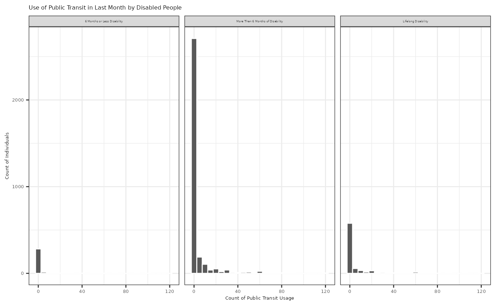
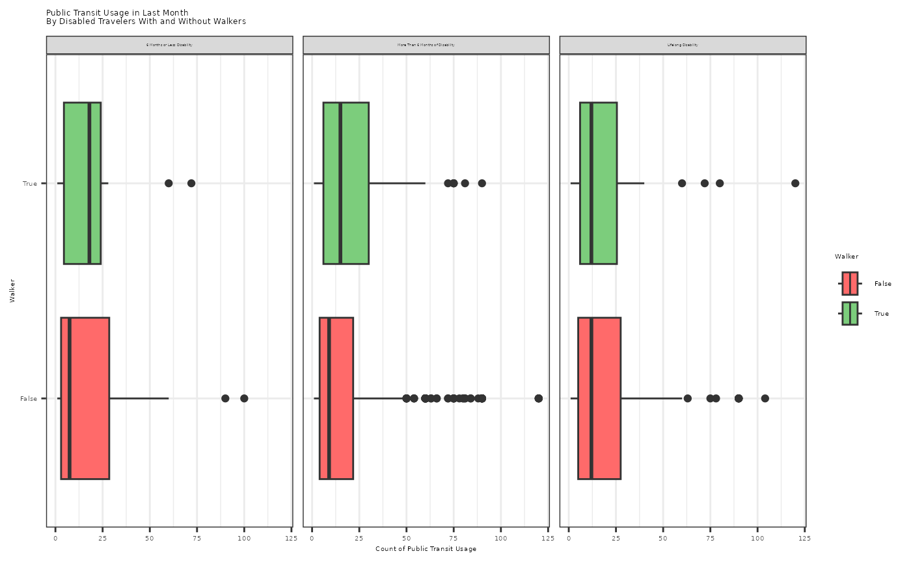

# tripaccess

## Setup

``` r

devtools::install()
```

``` r

library(tripaccess)
library(tidyverse)
```

## Single Table Wrangling and Data Visualization Example

``` r

#> Filtered to people who have a travel disability
tripaccess_disabled <- tripaccess |>
  filter(travel_disability != "No_disability")

#> Sort facet_wrap labels
tripaccess_disabled$travel_disability_sort_val <- factor(tripaccess_disabled$travel_disability, levels = c("6_months_or_less_disability", "More_than_6_months_of_disability", "Lifelong_disability"), labels = c("6 Months or Less Disability", "More Than 6 Months of Disability", "Lifelong Disability"))

#> Plot Use of Public Transit in Last Month by Disabled People
ggplot(data = tripaccess_disabled, 
       aes(x = count_of_public_transit_usage)) + 
  geom_histogram(bins = 25, color = "white") + 
  facet_wrap(~travel_disability_sort_val) + 
  labs(title = "Use of Public Transit in Last Month by Disabled People", 
       x = "Count of Public Transit Usage", 
       y = "Count of Individuals") +
  theme_bw() +
  theme(strip.text = element_text(size = 3),
        axis.text = element_text(size = 5),
        axis.title = element_text(size = 5),
        title = element_text(size = 5))
```



``` r


#> Summary statistics of public transit usage by disabled people who use a walker
tripaccess_disabled |>
  filter(walker == "True") |>
  group_by(travel_disability) |>
  summarize(public_transit_usage_median = median(count_of_public_transit_usage),
            public_transit_usage_mean = mean(count_of_public_transit_usage),
            public_transit_usage_sd = sd(count_of_public_transit_usage))
#> # A tibble: 3 × 4
#>   travel_disability                public_transit_usage…¹ public_transit_usage…²
#>   <chr>                                             <dbl>                  <dbl>
#> 1 6_months_or_less_disability                           0                   6.18
#> 2 Lifelong_disability                                   0                   7.78
#> 3 More_than_6_months_of_disability                      0                   5.09
#> # ℹ abbreviated names: ¹​public_transit_usage_median, ²​public_transit_usage_mean
#> # ℹ 1 more variable: public_transit_usage_sd <dbl>

#> Filtered to people who have a travel disability with public transit usage
disabled_public_transit_travel <- tripaccess_disabled |>
  filter(count_of_public_transit_usage > 0)

#> Plot Public Transit Usage in Last Month By Disabled Travelers With and Without Walkers
ggplot(data = disabled_public_transit_travel, 
       aes(x = count_of_public_transit_usage, 
           y = walker, 
           fill = walker)) +
  geom_boxplot() +
  facet_wrap(~travel_disability_sort_val) +
  labs(title = "Public Transit Usage in Last Month \nBy Disabled Travelers With and Without Walkers",
       fill = "Walker",
       x = "Count of Public Transit Usage", 
       y = "Walker") +
  theme_bw() +
  theme(strip.text = element_text(size = 2),
        axis.text = element_text(size = 4),
        axis.title = element_text(size = 4),
        title = element_text(size = 4),
        legend.text = element_text(size = 4),
        legend.title = element_text(size = 4)) +
  scale_fill_manual(values = c("indianred1", "palegreen3"))
```


